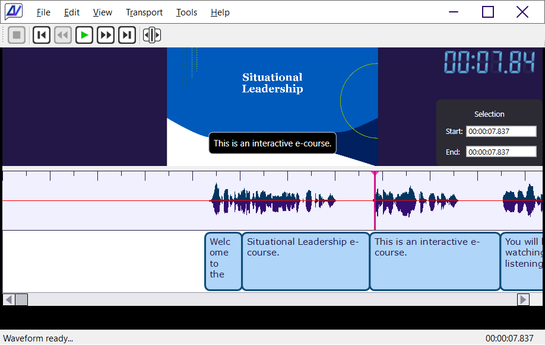

# CaptionAll Closed Captioning Editor

An intuitive, easy-to-use, fast-action, precise closed-caption editor desktop application for Windows.

&nbsp;

## Current Features

CaptionAll currently offers the following features.

-   Several styles of available caption editing functions like Text, Width, Insert Space, Insert Caption, Toggle Caption | Space, Merge Captions, Delete Caption and Find and Replace in captions.
-   Several selection styles such as Current Time, Selection Start Time, Selection End Time, Select None, Select Time From Caption, Snap Caption To Selection, and Center Cursor On Screen.
-   Easy access to track transport like Space or F5 to Play/Pause, F4 or left arrow key to go back 5 seconds, and F6 or right arrow key to go forward five seconds.
-   Mouse scroll pans the timeline window left and right.
-   Ripple mode editing allows you to decide whether inserting or deleting will affect the position of all remaining captions to the right.
-   Speed dial list provides up to nine quick values that can be inserted into the caption text with the press of a button.
-   Passive project-based handling. Load a caption file and a media file together with additional settings using a separate project file. Each source file remains available for direct use on the file system.

&nbsp;

## Keyboard Shortcuts

Following is the complete list of available keyboard shortcuts.

<table>
<tbody>
<tr class="odd">
<td><strong>Menu</strong></td>
<td><strong>Key</strong></td>
<td><strong>Description</strong></td>
</tr>
<tr class="even">
<td></td>
<td>Mouse Scroll Down</td>
<td>Pan right on caption timeline.</td>
</tr>
<tr class="odd">
<td></td>
<td>Mouse Scroll Up</td>
<td>Pan left on caption timeline.</td>
</tr>
<tr class="even">
<td></td>
<td>Esc</td>
<td>Shrink the form back to normal size from full screen mode.</td>
</tr>
<tr class="odd">
<td></td>
<td>F11</td>
<td>Maximize the form to full screen.</td>
</tr>
<tr class="even">
<td>Edit / Caption Properties</td>
<td>Ctrl + Enter</td>
<td>Edit the values associated with the selected caption. (Alt, E, P)</td>
</tr>
<tr class="odd">
<td>Edit / Caption Text</td>
<td>F2</td>
<td>Edit the text of the currently selected caption. (Alt, E, T)</td>
</tr>
<tr class="even">
<td>Edit / Caption Width</td>
<td>Ctrl + W</td>
<td>Set the width of the selected caption. (Alt, E, W)</td>
</tr>
<tr class="odd">
<td>Edit / Current Time</td>
<td>Ctrl + T</td>
<td>Set the playhead to a specific time. (Alt, E, R)</td>
</tr>
<tr class="even">
<td>Edit / Delete Caption</td>
<td>Ctrl + L</td>
<td>Delete the selected caption. (Alt, E, D)</td>
</tr>
<tr class="odd">
<td>Edit / Insert Caption</td>
<td>Ctrl + I</td>
<td>Insert a caption at the current selection or mouse position. (Alt, E, C)</td>
</tr>
<tr class="even">
<td>Edit / Insert Space</td>
<td>Ctrl + Shift + I</td>
<td>Insert a space at the current selection or mouse position. (Alt, E, S)</td>
</tr>
<tr class="odd">
<td>Edit / Ripple On | Off</td>
<td>Ctrl + R</td>
<td>Toggle ripple mode on and off. (Alt, E, I)</td>
</tr>
<tr class="even">
<td>Edit / Select Time From Caption</td>
<td>Ctrl + Shift + T</td>
<td>Set the selection range to the position and width of the selected caption. (Alt, E, L)</td>
</tr>
<tr class="odd">
<td>Edit / Selection End Time</td>
<td>F9</td>
<td>Set the end time of the selection. (Alt, E, E)</td>
</tr>
<tr class="even">
<td>Edit / Selection Start Time</td>
<td>F8</td>
<td>Set the start time of the selection. (Alt, E, A)</td>
</tr>
<tr class="odd">
<td>Edit / Snap Caption To Selection</td>
<td>Ctrl + E</td>
<td>Set the caption start and width values to the current selection. (Alt, E, N)</td>
</tr>
<tr class="even">
<td>Edit / Toggle Caption | Space</td>
<td>Ctrl + G</td>
<td>Convert the area at the current selection or mouse location between a caption and a space. (Alt, E, O)</td>
</tr>
<tr class="odd">
<td>Edit / Undo</td>
<td>Ctrl + Z</td>
<td>Undo the most recent action. (Alt, E, U)</td>
</tr>
<tr class="even">
<td>File / Exit</td>
<td>Alt + F4</td>
<td>Close the application. (Alt, F, X)</td>
</tr>
<tr class="odd">
<td>File / Open Captions</td>
<td>Ctrl + O</td>
<td>Open a caption file. (Alt, F, C)</td>
</tr>
<tr class="even">
<td>File / Open Media</td>
<td>Ctrl + M</td>
<td>Open a media file. (Alt, F, M)</td>
</tr>
<tr class="odd">
<td>File / Save Captions</td>
<td>Ctrl + S</td>
<td>Save the currently open caption file. (Alt, F, S)</td>
</tr>
<tr class="even">
<td>File / Save Captions As ...</td>
<td>Ctrl + Shift + S</td>
<td>Save the currently open caption file with a new filename. (Alt, F, A)</td>
</tr>
<tr class="odd">
<td>Transport / Go Back 5 Seconds</td>
<td>
F4 or

Left Arrow
</td>
<td>Move the playhead backward 5 seconds. (Alt, T, B)</td>
</tr>
<tr class="even">
<td>Transport / Go Forward 5 Seconds</td>
<td>
F6 or

Right Arrow
</td>
<td>Move the playhead forward 5 seconds. (Alt, T, F)</td>
</tr>
<tr class="odd">
<td>Transport / Go To End</td>
<td>F7</td>
<td>Move the playhead to the end of the track. (Alt, T, E)</td>
</tr>
<tr class="even">
<td>Transport / Go To Start</td>
<td>F3</td>
<td>Move the playhead to the start of the track. (Alt, T, S)</td>
</tr>
<tr class="odd">
<td>Transport / Play | Pause (Space Key)</td>
<td>
F5 or

Space
</td>
<td>Toggle between play and pause. (Alt, T, P)</td>
</tr>
<tr class="even">
<td>Transport / Stop</td>
<td>Alt + F5</td>
<td>Stop playing and reset the playhead position to 0. (Alt, T, S)</td>
</tr>
<tr class="odd">
<td>View / Center Cursor On Screen</td>
<td>Ctrl + Shift + C</td>
<td>Scroll the caption display area to center the playhead on the display. (Alt, V, C)</td>
</tr>
</tbody>
</table>

&nbsp;

## Coming Soon

The following features are scheduled to be available soon to any existing owners of CaptionAll.

-   Much more documentation.
-   Easier methods of distribution and setup.
-   When in ripple mode, real-time mouse resizing of a caption will be applied when the edge is dropped.
-   Export of text-based transcript from current layout of captions.
